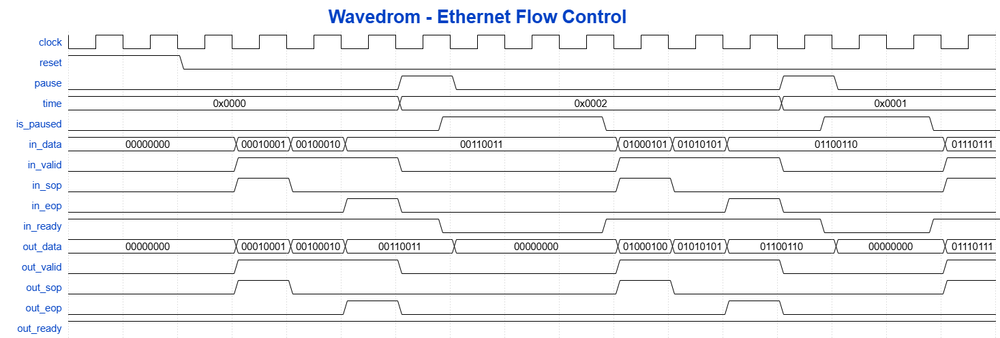
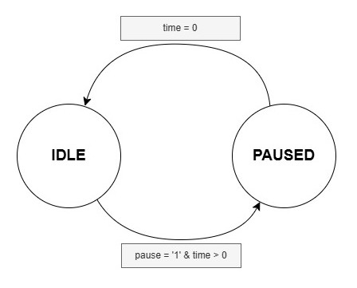

# Ethernet Flow Control

Ethernet flow control je mehanizam definisan standardom IEEE 802.3x koji omogućava privremeno zaustavljanje prijenosa podataka između Ethernet uređaja u cilju sprječavanja gubitka podataka usljed zagušenja. Mehanizam se zasniva na razmjeni specijalnih kontrolnih okvira poznatih kao Ethernet PAUSE okviri, kojim jedna strana može zatražiti pauzu prenosa od druge strane.

## Ethernet PAUSE okvir

Ethernet PAUSE okvir predstavlja MAC Control Ethernet okvir identifikovan EtherType vrijednošću 0x8808. Kada Ethernet okvir ima ovu EtherType vrijednost, njegov payload sadrži MAC kontrolne informacije, a ne korisničke podatke.

Unutar MAC Control nalazi se polje MAC Control Opcode, koje određuje konkretnu kontrolnu funkciju. Opcode vrijednost 0x0001 označava PAUSE funkciju. Polje `pause_time` definiše trajanje pauze u jedinicama (kvantima) trajanja 512 bitskih intervala (max. 65.535 jedinica).

  

U okviru ovog projekta bit će implementiran VHDL modul `ethernet_flow_control` koji podržava:
- generisanje Ethernet PAUSE okvira na osnovu upravljačkih signala `pause` i `time`
- prijem i dekodiranje PAUSE okvira
- kontrolu prenosa podataka putem signala `is_paused`

Komunikacija sa okruženjem ostvarena je korištenjem Avalon-ST interfejsa sa ready/valid rukovanjem.

## Blok dijagram modula

  

Modul `ethernet_flow_control` implementira Ethernet flow control mehanizam baziran na IEEE 802.3x PAUSE okviru. Modul prima upravljačke signale `pause` i `time`, kao i ulazni Avalon-ST interfejs (`in_data`, `in_valid`, `in_sop`, `in_eop`). Na izlazu generiše Avalon-ST interfejs (`out_data`,  `out_valid`, `out_sop`, `out_eop`) i statusni signal `is_paused`.

Modul koristi Avalon-ST interfejs sa ready/valid rukovanjem. Strana koja šalje podatke postavlja signal `valid` zajedno sa podacima i oznakama početka i kraja okvira (`sop`, `eop`). Strana koja prima podatke signalom `ready` označava svoju spremnost za prijem podataka. Prenos podataka se ostvaruje samo kada su signali `valid` i `ready` istovremeno aktivni.

### Opis signala modula

- `in_data` – podatak koji se prenosi u trenutnom ciklusu transfera Ethernet okvira na ulazu 
- `in_valid` – signal koji indicira da su podaci prisutni na signalu `in_data` u trenutnom ciklusu transfera validni
- `in_sop` – signal koji indicira početak prenosa Ethernet okvira na ulazu  
- `in_eop` – signal koji indicira kraj prenosa Ethernet okvira na ulazu  
- `in_ready` – signal koji indicira da je modul spreman za prijem ulaznih podataka u narednom ciklusu transfera 

- `out_data` – podatak koji se prenosi u trenutnom ciklusu transfera Ethernet okvira na izlazu 
- `out_valid` – signal koji indicira da su podaci prisutni na signalu `out_data` u trenutnom ciklusu transfera validni 
- `out_sop` – signal koji indicira početak prenosa Ethernet okvira na izlazu 
- `out_eop` – signal koji indicira kraj prenosa Ethernet okvira na izlazu  
- `out_ready` – signal koji indicira da je odredište spremno za prijem izlaznih podataka u narednom ciklusu transfera

- `pause` – upravljački signal za generisanje Ethernet PAUSE okvira  
- `time` – vrijednost koja se koristi kao polje `pause_time` u Ethernet PAUSE okviru  
- `is_paused` – statusni signal koji indicira da je prenos podataka trenutno pauziran usljed primljenog PAUSE okvira

## Opis komunikacije

Sekvencijalni dijagram prikazuje razmjenu Ethernet PAUSE okvira između dvije strane: Tx strane, koja inicira kontrolu toka, i Rx strane, koja reaguje na primljeni PAUSE okvir.

  

Tx strana formira i šalje Ethernet PAUSE okvir prema Rx strani. Okvir je identifikovan destinacijskom MAC adresom rezervisanom za MAC Control Okvire, EtherType vrijednošću 0x8808 i MAC Control Opcode vrijednošću 0x0001, čime se okvir prepoznaje kao PAUSE okvir. Polje `pause_time` u okviru određuje trajanje pauze prenosa.

Nakon prijema PAUSE okvira, Rx strana dekodira MAC Control polja okvira i na osnovu vrijednosti opcode i `pause_time`, aktivira stanje pauze prenosa podataka tokom definisanog vremenskog intervala.

Po isteku vremena definisanog poljem `pause_time`, Rx strana automatski napušta stanje pauze i nastavlja normalan prenos podataka.

## Waveform dijagram

WaveDrom dijagram prikazuje vremenski tok signala modula `ethernet_flow_control` tokom prijema Ethernet PAUSE okvira i trajanja pauze prenosa.

  

Dok signal `is_paused` nije aktivan, podaci se prenose kada su signali `in_valid` i `in_ready` aktivni. Prijem `PAUSE` zahtjeva aktivira signal `is_paused`, čime se obustavlja prijenos podataka: `in_ready` i `out_valid` se deaktiviraju, a `out_data` se postavlja na neutralnu vrijednost. Nakon isteka trajanja pauze definisanog signalom `time`, komunikacija se nastavlja.

## FSM dijagram

Rad modula `ethernet_flow_control` zasnovan je na konačnom automatu stanja (FSM) koji upravlja ponašanjem prenosa podataka u zavisnosti od prisustva PAUSE zahtjeva. FSM omogućava jasnu separaciju normalnog režima rada i režima pauze.

  

Automat se sastoji od dva osnovna stanja: IDLE, u kojem je prenos podataka dozvoljen i odvija se prema Avalon-ST pravilima, i PAUSED, u kojem je prenos privremeno obustavljen na osnovu vrijednosti trajanja pauze. Prelaz između stanja iniciran je prijemom PAUSE zahtjeva, dok se povratak u normalno stanje ostvaruje po isteku definisanog vremena pauze.

## Literatura

- https://en.wikipedia.org/wiki/Ethernet_flow_control
- https://www.intel.com/content/www/us/en/docs/programmable/683091/20-1/introduction-to-the-interface-specifications.html
- Predavanja iz predmeta *Arhitekture paketskih čvorišta*, V. prof. dr Enia Kaljića, mr. dipl. ing.: https://c2.etf.unsa.ba/course/view.php?id=158
