# Ethernet Flow Control

Ethernet Flow Control je mehanizam definisan standardom IEEE 802.3x koji omogućava privremeno zaustavljanje prijenosa podataka između Ethernet uređaja u cilju sprječavanja gubitka podataka usljed zagušenja. Mehanizam se zasniva na razmjeni specijalnih kontrolnih okvira poznatih kao Ethernet PAUSE okviri, kojim jedna strana može zatražiti pauzu prenosa od druge strane.

## Ethernet PAUSE okvir

Ethernet PAUSE okvir predstavlja MAC Control Ethernet okvir identifikovan EtherType vrijednošću 0x8808. Kada Ethernet okvir ima ovu EtherType vrijednost, njegov payload sadrži MAC kontrolne informacije, a ne korisničke podatke.

Unutar MAC Control nalazi se polje MAC Control Opcode, koje određuje konkretnu kontrolnu funkciju. Opcode vrijednost 0x0001 označava PAUSE funkciju. Polje `pause_time` definiše trajanje pauze u jedinicama (kvantima) trajanja 512 bitskih intervala (max. 65.535 jedinica).

---

  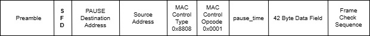

U okviru ovog projekta bit će implementiran VHDL modul `ethernet_flow_control` koji podržava:
- generisanje Ethernet PAUSE okvira na osnovu upravljačkih signala `pause` i `time`
- prijem i dekodiranje PAUSE okvira
- kontrolu prenosa podataka putem signala `is_paused`

Komunikacija sa okruženjem ostvarena je korištenjem Avalon-ST interfejsa sa ready/valid rukovanjem.

## Blok dijagram modula

  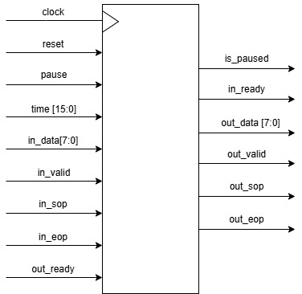

Modul `ethernet_flow_control` implementira Ethernet flow control mehanizam baziran na IEEE 802.3x PAUSE okviru. Modul prima upravljačke signale `pause` i `time`, kao i ulazni Avalon-ST interfejs (`in_data`, `in_valid`, `in_sop`, `in_eop`). Na izlazu generiše Avalon-ST interfejs (`out_data`,  `out_valid`, `out_sop`, `out_eop`) i statusni signal `is_paused`.

Modul koristi Avalon-ST interfejs sa ready/valid rukovanjem. Strana koja šalje podatke postavlja signal `valid` zajedno sa podacima i oznakama početka i kraja okvira (`sop`, `eop`). Strana koja prima podatke signalom `ready` označava svoju spremnost za prijem podataka. Prenos podataka se ostvaruje samo kada su signali `valid` i `ready` istovremeno aktivni.

### Opis signala modula

- `in_data` – podatak koji se prenosi u trenutnom ciklusu transfera Ethernet okvira na ulazu 
- `in_valid` – signal koji indicira da su podaci prisutni na signalu `in_data` u trenutnom ciklusu transfera validni
- `in_sop` – signal koji indicira početak prenosa Ethernet okvira na ulazu  
- `in_eop` – signal koji indicira kraj prenosa Ethernet okvira na ulazu  
- `in_ready` – signal koji indicira da je modul spreman za prijem ulaznih podataka u narednom ciklusu transfera 

- `out_data` – podatak koji se prenosi u trenutnom ciklusu transfera Ethernet okvira na izlazu 
- `out_valid` – signal koji indicira da su podaci prisutni na signalu `out_data` u trenutnom ciklusu transfera validni 
- `out_sop` – signal koji indicira početak prenosa Ethernet okvira na izlazu 
- `out_eop` – signal koji indicira kraj prenosa Ethernet okvira na izlazu  
- `out_ready` – signal koji indicira da je odredište spremno za prijem izlaznih podataka u narednom ciklusu transfera

- `pause` – upravljački signal za generisanje Ethernet PAUSE okvira  
- `time` – vrijednost koja se koristi kao polje `pause_time` u Ethernet PAUSE okviru  
- `is_paused` – statusni signal koji indicira da je prenos podataka trenutno pauziran usljed primljenog PAUSE okvira

## Opis komunikacije

Sekvencijalni dijagram prikazuje razmjenu Ethernet PAUSE okvira između dvije strane: Tx strane, koja inicira kontrolu toka, i Rx strane, koja reaguje na primljeni PAUSE okvir.

 

  

Tx strana formira i šalje Ethernet PAUSE okvir prema Rx strani. Okvir je identifikovan destinacijskom MAC adresom rezervisanom za MAC Control Okvire, EtherType vrijednošću 0x8808 i MAC Control Opcode vrijednošću 0x0001, čime se okvir prepoznaje kao PAUSE okvir. Polje `pause_time` u okviru određuje trajanje pauze prenosa.

Nakon prijema PAUSE okvira, Rx strana dekodira MAC Control polja okvira i na osnovu vrijednosti opcode i `pause_time`, aktivira stanje pauze prenosa podataka tokom definisanog vremenskog intervala.

Po isteku vremena definisanog poljem `pause_time`, Rx strana automatski napušta stanje pauze i nastavlja normalan prenos podataka.

## Waveform dijagram

WaveDrom dijagram prikazuje kompletan proces generisanja, prenosa i detekcije Ethernet Pause okvira. 

 

  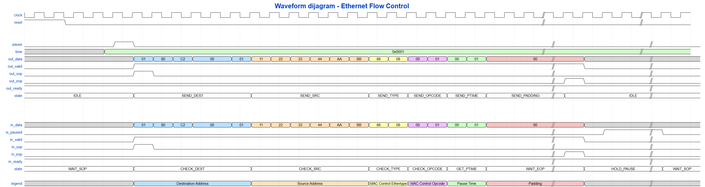

Osnovna ideja Ethernet Flow Control mehanizma jeste da na osnovu zahtjeva generiše Ethernet Pause paket koji drugoj strani signalizira privremeno zaustavljanje slanja podataka. Implementiraju se predajne (Tx) i prijemne (Rx) stanice unutar jedne logičke cjeline. Ovakav pristup omogućava modulu da funkcioniše u dva osnovna režima rada, zavisno od mrežnog događaja.

### 1. Režim inicijatora pauze (Tx)

U ovom režimu, modul reaguje na ulazni signal `pause`. Definiše se željeno trajanje pauze preko ulaznog signala `time`. Aktiviranjem signala `pause`, generiše se PAUSE okvir na `out_data` interfejsu. Modul formira zaglavlje (Destination Address, Source Address, MAC Ethertype 0x8808, MAC Opcode 0x0001) i definiše vrijednost pauze koja je stigla na ulaz.

### 2. Režim izvršioca pauze (Rx)

U ovom režimu, kada modul na svom `in_data` interfejsu detektuje dolazni kontrolni okvir, on automatski preuzima ulogu prijemne stanice. Rx izvršava parsiranje zaglavlja i po potvrdi validnosti PAUSE okvira vrši ekstrakciju vrijednosti vremena pause `Pause Time`. Pomoću unutrašnjeg brojača skalira se primljena vrijednost prema standardu tako da jedan kvant pauze odgovara 64 bajta, odnosno 64 clock intervala. Tokom rada brojača, signal `is_paused` se održava na logičnoj '1' blokirajući dalje slanje podataka sve do isteka definisanog vremena.

## FSM dijagram

Rad modula `ethernet_flow_control` zasnovan je na konačnom automatu stanja (FSM) koji upravlja ponašanjem prenosa podataka u zavisnosti od prisustva PAUSE zahtjeva. 

### FSM - režim incijatora pauze

  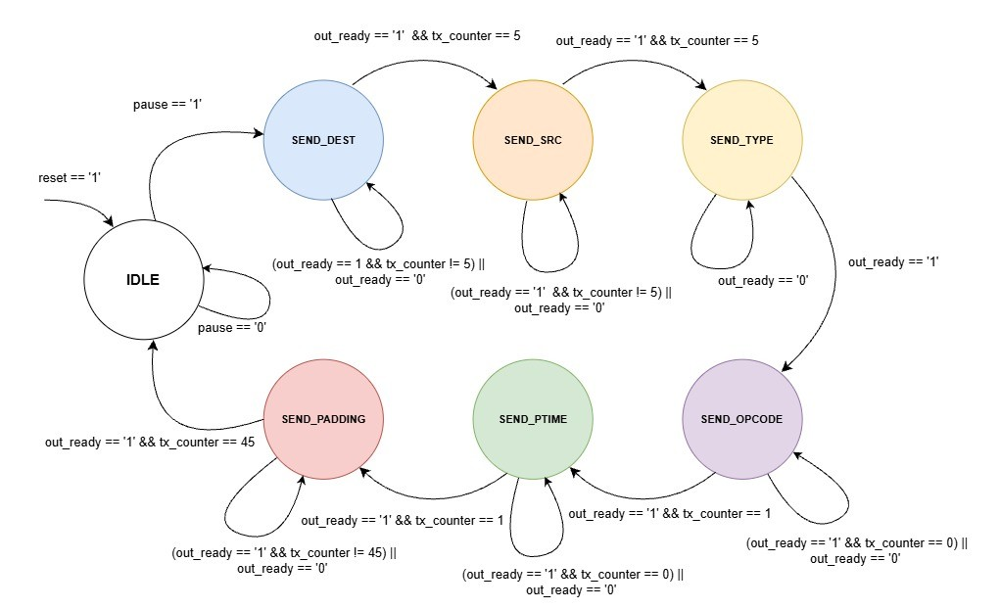

FSM je dizajniran kao _Moore_-ov automat. FSM režima incijatora pauze sadrži sljedeća stanja:

1. **IDLE** - stanje mirovanja, 
2. **SEND_DEST** - šalje MAC adresu (01:80:C2:00:00:01),
3. **SEND_SRC** - šalje MAC adresu lokalnog uređaja (11:22:33:44:AA:BB),
4. **SEND_TYPE** - šalje EtherType 0x8808,
5. **SEND_OPCODE** - šalje Opcode 0x0001 (PAUSE komanda),
6. **SEND_PTIME** - šalje trajanje pauze i
7. **SEND_PADDING** - generiše nule (0x00) kako bi se dostiglo minimalno 64 bajta paketa.

---

### FSM - režim izvršioca pauze

  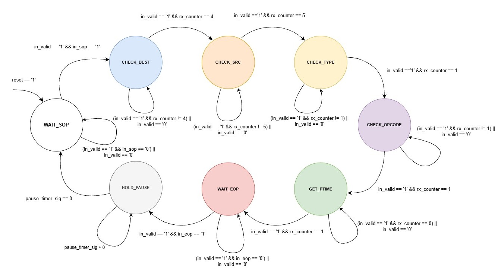

FSM je dizajniran kao _Moore_-ov automat. FSM režima izvršioca pauze sadrži sljedeća stanja:

1. **WAIT_SOP** - čeka početak okvira, 
2. **CHECK_DEST** - provjerava MAC adresu (01:80:C2:00:00:01),
3. **CHECK_SRC** - provjerava izvor (11:22:33:44:AA:BB),
4. **CHECK_TYPE** - provjera EtherType 0x8808,
5. **CHECK_OPCODE** - potvrda da se radi o PAUSE komandi (0x0001),
6. **GET_PTIME** - upisuje vrijeme pauze u interni registar i
7. **WAIT_EOP** - čeka se kraj paketa.
8. **HOLD_PAUSE** - izlazni signal `is_paused` jednak logičkoj '1' dok interni brojač ne odbroji do nule.

## Ethernet Flow Control - VHDL modul

  
`ethernet_flow_control` modul implementira Ethernet Flow Control koristeći IEEE 802.3x *pause* okvir,
sa jasno razdvojenom predajnom (Tx) i prijemnom (Rx) stranom. Logika je pretežno
sekvencijalna i realizovana kroz dva nezavisna FSM-a: jedan koji generiše pause
okvir kada je aktivan signal `pause`, i drugi koji dekodira primljeni pause okvir
i izvlači `pause time`.

Komunikacija sa ostatkom sistema realizovana je preko Avalon-ST tipa, sa `valid/ready` rukovanjem
i podrškom za `sop/eop` signale. Tx strana šalje bajt-po-bajt Ethernet pause okvir
kroz stanja (dest, src, type, opcode, time, padding), dok Rx strana prati tok
okvira, prepoznaje strukturu pause poruke i pokreće interni tajmer.

Kada se primi validan pause okvir, modul ulazi u stanje pauze i generiše signal
`is_paused` tokom trajanja definisanog `pause time` poljem, čime se simulira
realno Ethernet flow control ponašanje.

### Compilation report

  

VHDL `ethernet_flow_control` modul je uspješno sintetiziran u Quartus Prime Lite razvojnog okruženja.

### FSM dijagrami VHDL modula 

 
U nastavku su prikazani FSM dijagrami predajne (Tx) i prijemne (Rx) strane modula,
generisani direktno u Quartus Prime Lite FSM Viewer-u. Dijagrami u dokumentaciji se slažu sa očekivanim 
stanjima i prijelazima definisanim u dizajnu. 

 

  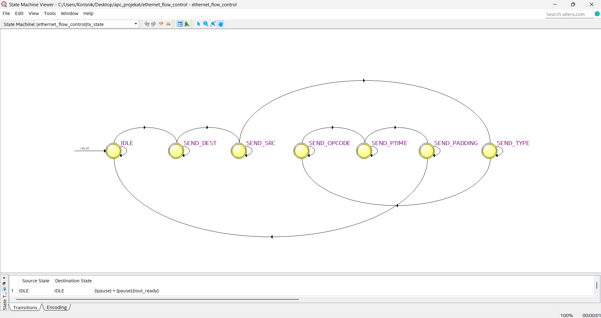

 

  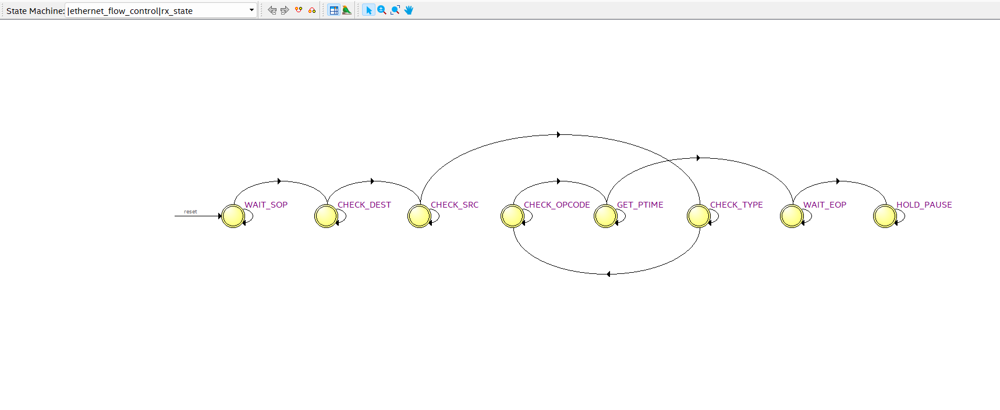

### RTL Viewer

  
Na RTL Viewer prikazu vide se svi ulazni i izlazni signali modula, kao i kompletna unutrašnja logika generisana iz VHDL koda.  
Struktura pokazuje kako se opis u VHDL-u prevodi u stvarne hardverske blokove poput osnovnih logičkih kola, multipleksera i registara.

 

  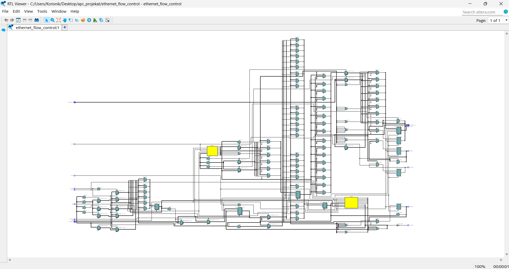

### ModelSim

U projektu su definisana četiri različita testbench-a, od kojih svaki demonstrira specifičan scenarij rada modula:

1. Osnovni testbench - bez _backpressure_ i `pause_time` = 0x0001
2. Testbench sa dužom pauzom - `pause_time` = 0x0002
3. Testbench sa _backpressure_ u sredini paketa
<!--4. Testbench sa _backpressure_ na samom početku paketa-->

Cilj podjele jeste da se jasno pokaže ponašanje modula pri različitim vrijednostima pauze i otpornost modula na _backpressure_ u različitim fazama prenosa.

  
U ModelSim okruženju izvršena je simulacija rada modula koristeći testbench. Na osnovu transcripta može se zaključiti da su svi entiteti i arhitekture pravilno učitani i da je simulacija započela bez problema.

 

  

 

  
### 1. Osnovni testbench
 
Tokom simulacije u ModelSim-u posmatrani su talasni oblici svih relevantnih signala modula. Dobijeni waveform prikaz je u skladu sa WaveDrom dijagramom prethodno prikazanim u ovom dokumentu. Redoslijed generisanja PAUSE okvira, prijema okvira i aktivacije signala `is_paused` odgovara očekivanom ponašanju definisanom u specifikaciji modula. 

 

  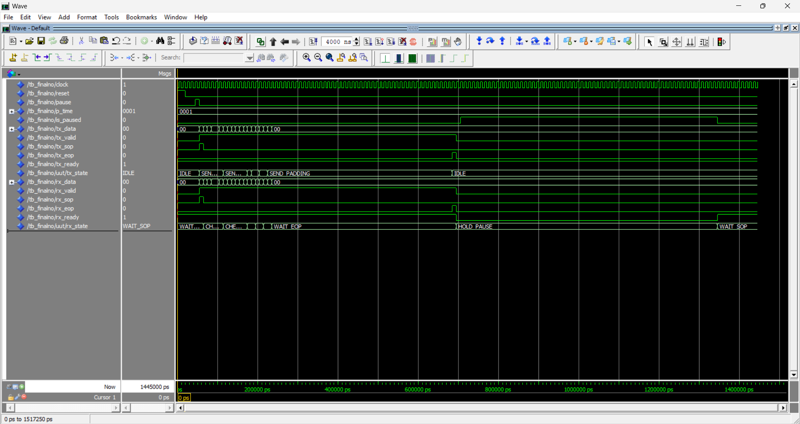

 

  
Prvi prikaz daje kompletan pregled simulacije i omogućava uvid u cjelokupan tok događaja – od generisanja PAUSE okvira, preko njegovog prijema, do isteka pauze. Drugi i treći prikaz predstavljaju uvećani dio istog talasnog oblika, kako bi se jasno mogle vidjeti pojedinačne promjene signala, vrijednosti `data` signala i stanja FSM automata.

 

  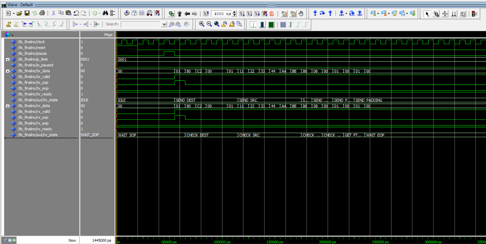

  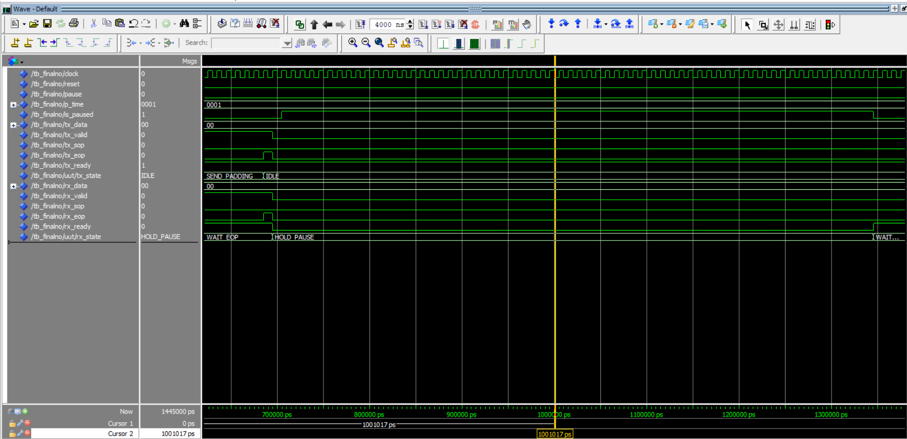

  
Na gornjem prikazu se jasno vidi redoslijed bajtova koji čine PAUSE okvir, kao i prelazak Tx i Rx FSM-ova kroz odgovarajuća stanja tokom prenosa.  
Donji prikaz fokusiran je na trajanje pauze nakon prijema PAUSE okvira. Za vrijednost `pause_time = 0x0001`, modul generiše pauzu u trajanju od jednog kvanta, što odgovara 512 bitskih intervala, odnosno 64 bajta ili 64 clock ciklusa. Pomoću kursora je očitano trajanje pauze 640 ns. Tokom tog perioda signal `is_paused` ostaje aktivan, a po isteku tog vremena automatski se vraća u neaktivno stanje.  Signal `out_ready` je postavljen na logičku vrijednost '1' i ne postoji _backpressure_.

### 2. Testbench sa dužom pauzom

  
Drugi testbench je skoro identičan osnovnom, ali se razlikuje po vrijednosti `pause_time` = 0x0002. 

 

  

  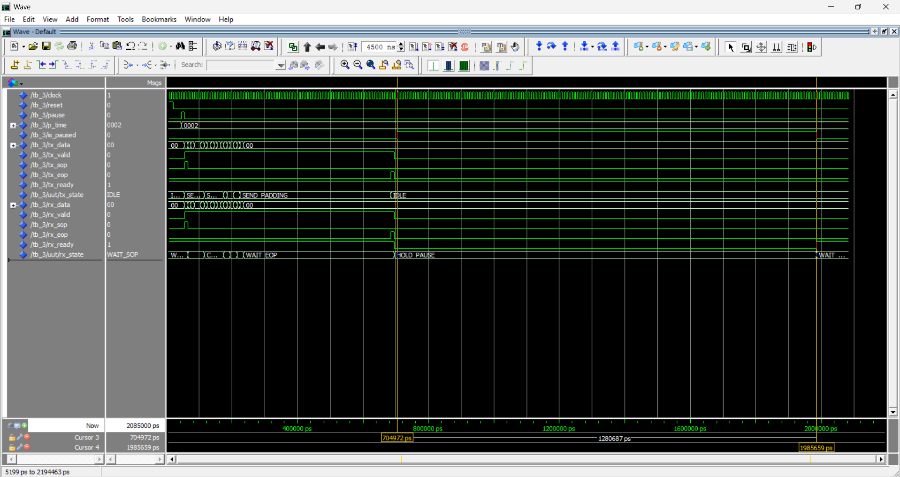

  
U osnovnom testbench-u, gdje je `pause_time` = 0x0001, razlika između kursora iznosi 640 ns, što odgovara trajanju pauze od jednog kvanta, a u testbenchu-u sa dužom pauzom (`pause_time` = 0x0002), kursori pokazuju da signal `is_paused` ostaje aktivan 1280 ns, što je tačno dvostruko duže nego u osnovnom slučaju i potvrđuje da modul pravilno skalira trajanje pauze u zavisnosti od `pause_time`. 

### 3. Testbench sa _backpressure_ u sredini paketa

U ovom testbenchu se uvodi _backpressure_, to jeste signal `out_ready` se privremeno postavlja na logičku vrijednost '0'. Cilj ovog scenarija jeste da se pokaže da modul zaustavlja slanje podataka kada je `out_ready` = 0, zadržava trenutni bajt i stanje FSM-a, nastavlja tačno od istog mjesta kada `out_ready` ponovo postane 1 i ne dolazi do gubitka ili preskakanja bajtova.

 

  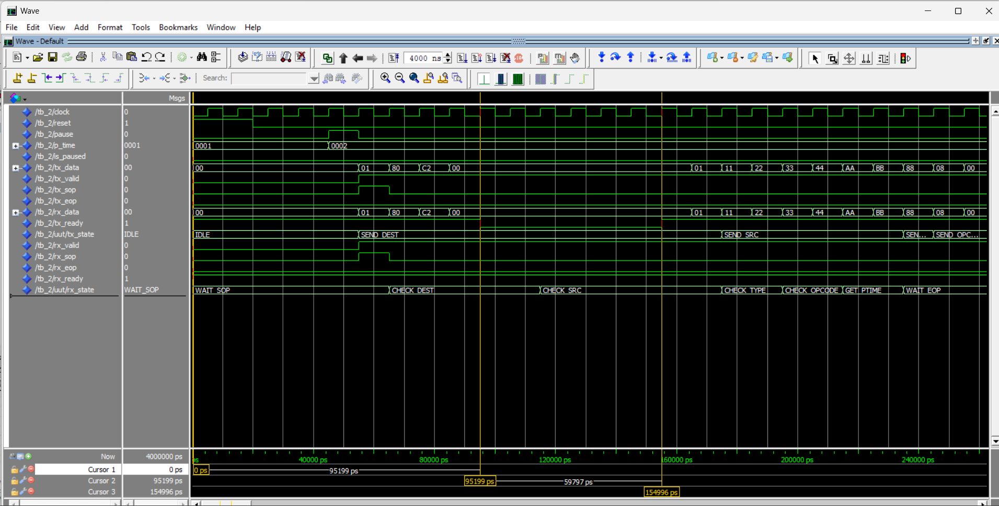

Ovaj testbench dokazuje da modul pravilno podržava _backpressure_ u toku aktivnog prenosa podataka.

<!--
### Testbench sa _backpressure_ na samom početku paketa
div align="justify">

U posljednjem testbenchu se simulira slučaj kada je signal `out_ready` = 0 tačno u trenutku kada modul želi započeti slanje paketa. Provjerava se da li modul ne započinje slanje dok je `out_ready` = 0, ne dolazi do gubitka početnog bajta paketa i kompletan paket se šalje tek kada se steknu uslovi (`out_ready` = 1).

 

  

div align="justify">

Ovaj testbench dokazuje da modul pravilno odlaže slanje paketa kada izlazni interfejs nije spreman od samog početka prenosa.

-->
## Zaključak

  
U okviru ovog projekta realizovan je VHDL modul `ethernet_flow_control` koji implementira Ethernet Flow Control mehanizam definisan standardom IEEE 802.3x. Modul omogućava generisanje, prijem i obradu Ethernet PAUSE okvira, kao i kontrolu toka podataka putem signala `is_paused`, uz korištenje Avalon-ST interfejsa sa ready/valid rukovanjem.

Funkcionalnost modula verifikovana je kroz blok dijagrame, FSM dijagrame, RTL prikaz i simulaciju u ModelSim okruženju. Dobijeni rezultati pokazuju da se modul ponaša u skladu sa specifikacijom: pravilno generiše PAUSE okvir, ispravno dekodira primljeni okvir i precizno realizuje trajanje pauze na osnovu polja `pause_time`.

U budućem razvoju modul se može unaprijediti tako da podržava promjenjive MAC adrese, rad sa više tokova podataka, praćenje broja poslatih i primljenih PAUSE okvira, te prilagođavanje za rad u većim i bržim mrežama.

## Literatura
- https://en.wikipedia.org/wiki/Ethernet_flow_control
- https://www.intel.com/content/www/us/en/docs/programmable/683091/20-1/introduction-to-the-interface-specifications.html
- Predavanja iz predmeta *Arhitekture paketskih čvorišta*, V. prof. dr Enia Kaljića, mr. dipl. ing.: https://c2.etf.unsa.ba/course/view.php?id=158
