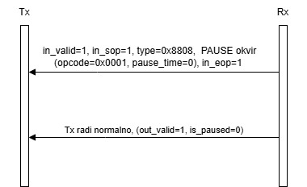
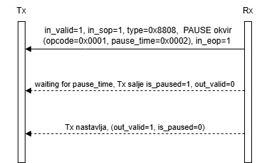

# Ethernet Flow Control

Ethernet flow control je mehanizam definisan standardom IEEE 802.3x koji omogućava privremeno zaustavljanje prijenosa podataka između Ethernet uređaja u cilju sprječavanja gubitka podataka usljed zagušenja. Mehanizam se zasniva na razmjeni specijalnih kontrolnih okvira poznatih kao PAUSE okviri. Vrijednost ovog polja predstavlja broj vremenskih kvanti tokom kojih se prenos treba pauzirati.

### Struktura Ethernet PAUSE okvira

Ethernet PAUSE okvir je identifikovan pomoću Opcode i Pause time polja. Struktura okvira je data ispod:

U okviru ovog projekta bit će implementiran VHDL modul `ethernet_flow_control` koji podržava:
- generisanje Ethernet PAUSE okvira na osnovu upravljačkih signala `pause` i `time`
- prijem i dekodiranje PAUSE okvira
- kontrolu prenosa podataka putem signala `is_paused`

Komunikacija sa okruženjem ostvarena je korištenjem Avalon-ST interfejsa sa ready/valid rukovanjem.

## Blok dijagram modula

Modul `ethernet_flow_control` implementira Ethernet flow control mehanizam baziran na IEEE 802.3x PAUSE okviru. Modul prima upravljačke signale `pause` i `time`, kao i ulazni Avalon-ST interfejs (`in_data`, `in_valid`, `in_sop`, `in_eop`). Na izlazu generiše Avalon-ST interfejs (`out_data`,  `out_valid`, `out_sop`, `out_eop`) i statusni signal `is_paused`.

Signal `in_ready` kontroliše prijem ulaznih podataka, dok signal `out_ready` omogućava slanje podataka ka prijemniku.

### Scenario 1: Prijem PAUSE okvira sa pause-time = 0

U ovom scenariju modul prima Ethernet PAUSE okvir definisan sa:
- `type = 0x8808`
- `opcode = 0x0001`
- `pause_time = 0`

Tok događaja:
- `in_valid = 1` i `in_sop = 1` označavaju početak PAUSE okvira
- PAUSE okvir je uspješno detektovan i parsiran
- `in_eop = 1` označava kraj okvira

Pošto je `pause_time = 0` pauza se ne aktivira i modul nastavlja normalan rad.

Rezultat:
- `is_paused = 0`
- `out_valid = 1`
- Prenos podataka se odvija bez prekida

### Scenario 2: Prijem PAUSE okvira sa pause-time > 0

U ovom scenariju modul prima Ethernet PAUSE okvir sa vrijednošću `pause_time = 0x0002`.

Tok događaja:
- Detekcija PAUSE okvira (`type = 0x8808`, `opcode = 0x0001`)
- Izdvajanje vrijednosti `pause_time`
- Aktivacija mehanizma pauze

Tokom trajanja pauze:
- `is_paused = 1`
- `out_valid = 0`
- Slanje podataka je privremeno obustavljeno

Nakon isteka pauze:
- `is_paused` se vraća na `0`
- `out_valid = 1`
- Normalan prenos podataka se nastavlja

